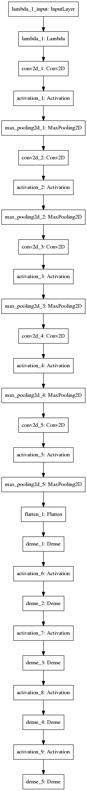

# Files Submitted & Code Quality

## 1. Submission includes all required files and can be used to run the
  simulator in autonomous mode

My project includes the following files:

* model.py containing the script to create and train the model
* drive.py for driving the car in autonomous mode
* model.h5 containing a trained convolution neural network
* writeup_report.md or writeup_report.pdf summarizing the results

## 2. Submission includes functional code Using the Udacity provided
  simulator and my drive.py file, the car can be driven autonomously
  around the track by executing: python drive.py model.h5

## 3. Submission code is usable and readable

The model.py file contains the code for training and saving the
convolution neural network. The file shows the pipeline I used for
training and validating the model, and it contains comments to explain
how the code works.

# Model Architecture and Training Strategy

## 1. An appropriate model architecture has been employed

The model is built off of Nvidia's "end-to-end" architecture (link in
code). It consists of five convolution layers with 5x5 or 3x3 filters
and depths between 24 and 64. ReLu and Max pooling is added with 2x2
after each convolution. Four fully connected layers conclude the
topology narrowing from 1164 to the final 10 classes.

    

## 2. Attempts to reduce overfitting in the model

The model contains no dropout layers. Overfitting is controlled using
Keras' built-in image generator to randomly distort images at 20K per
epopch with a train-cv split of 20%.

## 3. Model parameter tuning

The model uses an adam optimizer with learning rate of 1e-4 and mean
square error loss.

## 4. Appropriate training data

Training data was chosen to keep the vehicle driving on the road. I
used a combination of center lane driving, recovering from the left
and right sides of the road... which went terribly because I have
neurological dysfunction. Thus, I downloaded sample data from Github.

Here are some samples from the training data:

Left| Center | Right
----|--------|-------
 |  | 

To amp up the training robustness, Keras' sexy generator library was
used to create mock data. Two generators were created for training and
cross-validation.

# Final Model Architecture and Training Strategy

## 1. Solution Design Approach

The overall strategy for deriving a model architecture was to exactly
copy the Nvidia topology. The final step was to run the simulator to
see how well the car was driving around track one. There were a few
spots where the vehicle behaves poorly, but at the end of the process,
the vehicle is able to drive autonomously around the track without
leaving the road.

## 2. Final Model Architecture

The final model architecture is the Nvidia arch with no
modifications.

## 3. Creation of the Training Set & Training Process

To capture good driving behavior, I relied on the quality of the
sample data collected from Github. To augment the data sat, I applied
a set of random distortions: flip, gamma, shear, rotation, min/max
scaling, size, cropping. I used this training data for training the
model. The validation set helped determine if the model was over or
under fitting. The ideal number of epochs was 20 as evidenced by the
plateau of loss.

## 4. Comments

1. Without access to a GPU p2 instance via my employer, this project
would have been intractable. The datasets are too large and the
computing needs to intense for a laptop or standard g-type AWS
instance.

2. This seems like a problem for which some flavor of RNN would be
best (LSTM or GRU). Adding those options as examples would be
extremely revealing for students.
