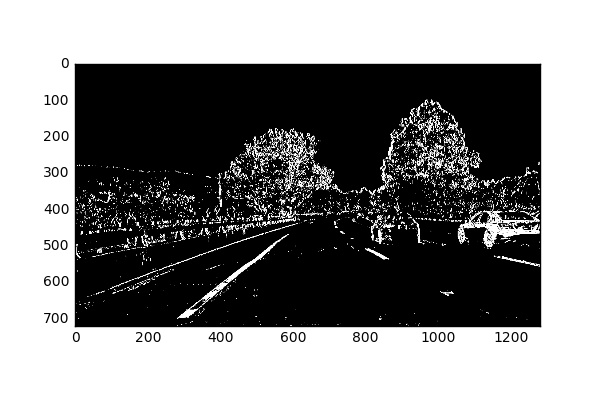
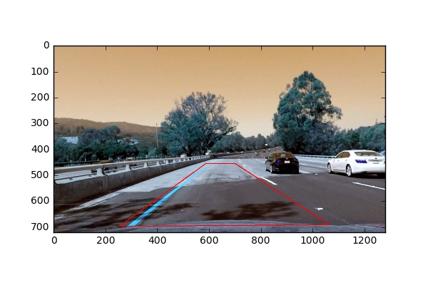

All reference images are provided in the Jupyter Notebook accompanying this write-up.

### Camera Calibration

#### 1. Briefly state how you computed the camera matrix and distortion coefficients. Provide an example of a distortion corrected calibration image.

Each calibration image is read in, converted to grayscale, passed to the chessboard corner finder in OpenCV, and the image & object point corners are appended to a master list. These values are then fed to the camera calibrator in OpenCV to return the distortion matrix. The coefficients are then stored as a pickle for future use in the pipeline. An undistorted image example is provided in the notebook.

### Pipeline (single images)

#### 1. Provide an example of a distortion-corrected image.

#### 2. Describe how (and identify where in your code) you used color transforms, gradients or other methods to create a thresholded binary image.  Provide an example of a binary image result.

Code sections have headers labeled: Distortion correction and color thresholding.

* Threshold x-gradient
* Threshold S-color channel
* Combine the two thresholded images to generate a binary image.
* Thresholds were determined via trial and error. 

#### 3. Describe how (and identify where in your code) you performed a perspective transform and provide an example of a transformed image.

Code sections have headers labeled: Perspective Transform

* I chose a finite, hard-coded region of interest using a binary mask.
* The image was transformed a birds-eye perspective.
* I then hard-codes the source and destination polygon coordinates.
* The image was warped to obtain the perspective transform.

#### 4. Describe how (and identify where in your code) you identified lane-line pixels and fit their positions with a polynomial?

See code section: Detect lanes.

* The image was divided into N-horizontal steps.
* For each step, the hot pixels were summed using a smoothed histogram.
* The peaks in the histogram were identified as presumed to the representative of the lane lines.
* The hot pixels nearest the peaks were aggregated together to capture the full lane line.
* A second order polynomial was fitted to each hot pixel distribution.
* The fitted area was then filled with a polygon for visual impact.

#### 5. Describe how (and identify where in your code) you calculated the radius of curvature of the lane and the position of the vehicle with respect to center.

See section: Lane curvature.

#### 6. Provide an example image of your result plotted back down onto the road such that the lane area is identified clearly.

* The warp transform was inverted to put the polygons back onto the original image.

### Pipeline (video)

#### 1. Provide a link to your final video output.  Your pipeline should perform reasonably well on the entire project video (wobbly lines are ok but no catastrophic failures that would cause the car to drive off the road!).

Here's a [link to my video result](./project_output.mp4)

### Discussion

#### 1. Briefly discuss any problems / issues you faced in your implementation of this project.  Where will your pipeline likely fail?  What could you do to make it more robust?

* Issue 1: I'm rushing through these projects to finish before the deadline March 27, so all the hard-coded work makes me sick. The point mappings should be automated and iterated to find the ideal values. The same is true of the thresholds. The thresholds should also be viewed in more than one channel.

* Issue 2: The polynomial fitting is a hack job. The data is linearly seperable, so with appropriate time, I would use an SVM to construct a robust model for finding lane lines (solid and dashed). I'd train it offline and then make predictions to tune.

* Issue 3: The warping is not ideal and I'm using single channel images (grayscale). I'd prefer to create warped views using ratios of channels, or modified images, e.g. CMYK or magnitude spectrum.

The pipeline fails miserably when it cannot find a second lane line (see the challenge video where the whole pipeline is a disaster).